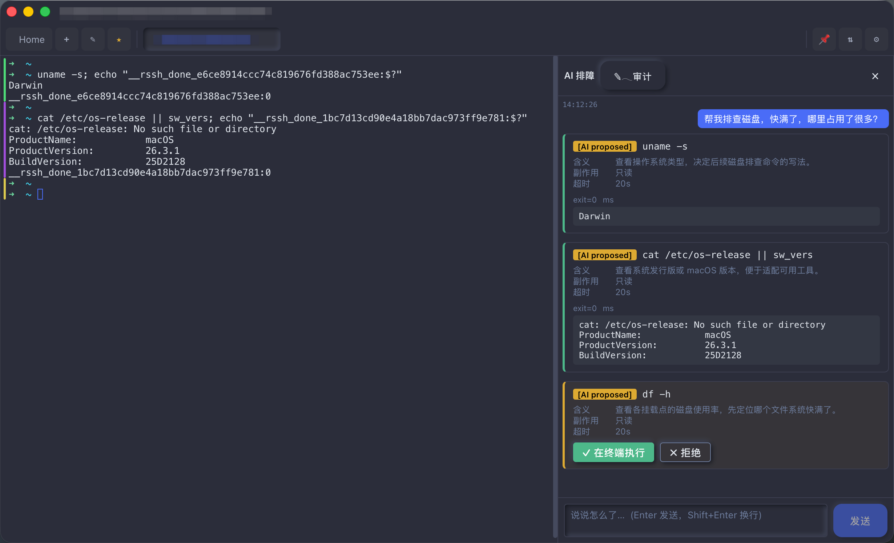
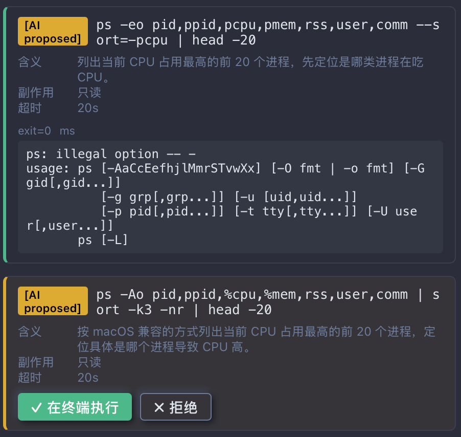
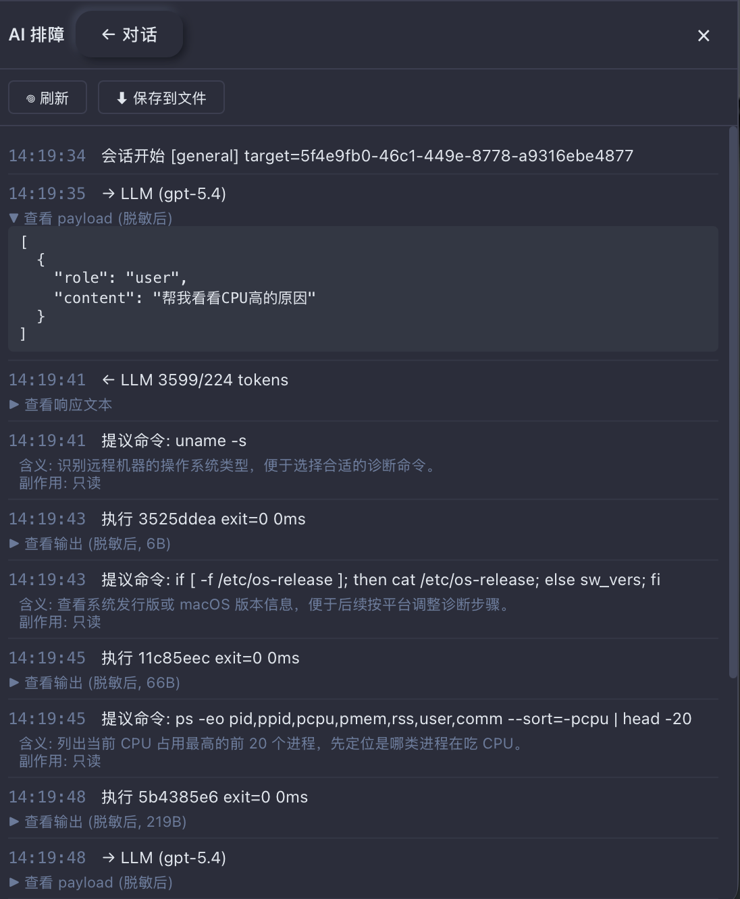
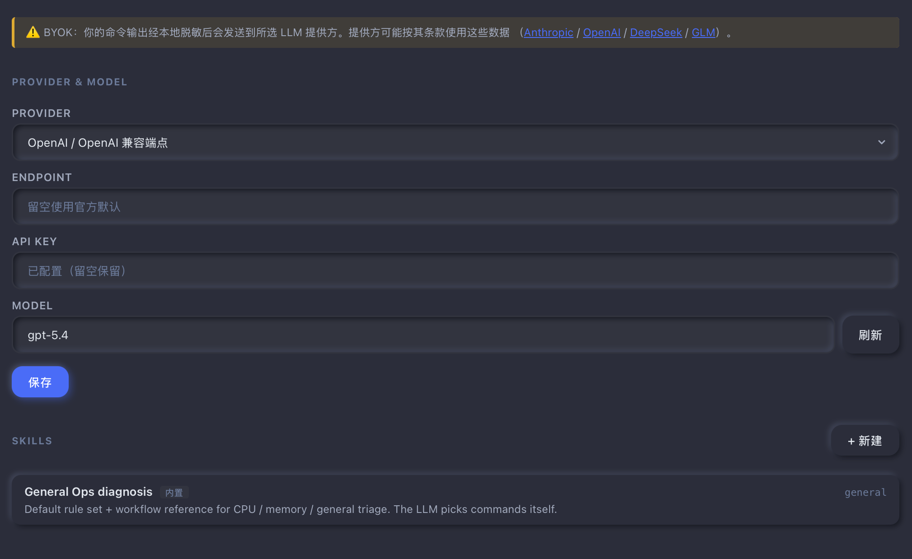

# rssh AI 排障助手 —— SSH 客户端天生该长这样

## 痛点

CPU 跑满了、Java 堆爆了、Go 进程吃着 8 个 G —— 现在的"AI 帮你排障"流程是这样的：

1. 在终端跑命令，肉眼看输出
2. 切到浏览器 AI Chat 网页，把输出复制粘贴进去
3. AI 回你一条命令，复制回来粘到终端
4. 命令的输出再复制回 AI ……

人变成了 LLM 和终端之间的搬运工。更糟的是：

- **token、密码、内网 IP 直接外发**，没人帮你脱敏
- 终端里的 ANSI 颜色、宽字符到了 Chat 网页全乱套
- 上下文一长就触发 truncate，前面跑的诊断步骤全丢
- 大模型让你跑 `top` —— 你照做了，它收到的是 ANSI 重绘垃圾

## SSH 客户端就在命令的 I/O 中间

这件事本来该 SSH 客户端做。所有命令输入输出本来就从它过，给 LLM 一组结构化工具，让它驱动诊断，人只在关键节点确认。

rssh 提供四个工具给 LLM：

```
run_command(cmd, explain, side_effect, timeout_s?)   # 在 SSH 会话里跑一条命令
download_file(remote_path, max_mb)                   # SFTP 一个远端文件到本地
analyze_locally(local_path, task)                    # 开新窗口 + 本地 shell + 独立 AI 分析
load_skill(id)                                       # 按需加载用户自定义 skill
```

LLM 看到症状自己挑工具、自己挑命令、自己解释为什么这么挑。人只看着、确认、必要时拒绝。



## 四道墙 —— 安全不靠 prompt 自律

LLM 是不可信的。靠 prompt 写 "请不要执行 rm -rf" 是儿戏。rssh 在进程内堆了四道硬墙，每一道都在 Rust 代码里 enforce，prompt 写啥都绕不过去。

### 第一道：shape validator

`src-tauri/src/ai/sanitize.rs` 里硬编码的拦截规则：

- **破坏性命令名**：`rm / kill / pkill / killall / dd / mkfs / iptables / ip6tables / mount / umount / shutdown / reboot / halt / poweroff / exec`，包括 `&&` / `;` / `|` 之后第一个 token
- **递归权限改动**：`chmod -R` / `chown -R`
- **fork bomb**：`:(){:|:&};:` 形态
- **刷屏命令**：裸 `top`（无 `-b` 或 `-l`）、`htop` / `watch` / `tail -f` / `vim` / `less` / `tmux`
- **无次数循环**：`vmstat 1` 必须写成 `vmstat 1 5`，`iostat`、`jstat`、`pidstat`、`sar` 同理

被拦的命令 rssh **不发给 SSH**，而是把拒绝原因塞回 LLM，让它换一条。最多两次同步骤重试，超过就摆手让用户接管。

### 第二道：本地脱敏

发给 LLM 前过一遍正则，默认规则：

| 模式 | 替换为 |
|---|---|
| `10.x.x.x` / `172.16-31.x.x` / `192.168.x.x` | `<REDACTED:ip-10>` 等 |
| `Bearer XXXXXXX` | `<REDACTED:bearer>` |
| `sk-XXXXX` | `<REDACTED:sk-key>` |
| `eyJ...JWT 三段` | `<REDACTED:jwt>` |
| 长 ≥32 位 hex | `<REDACTED:hex>` |

可以在设置里加自定义规则（正则 + 替换串）—— 公司有内部 token 模式就自己加一条。

**关键**：脱敏在 rssh 本地完成，不依赖 LLM 自律。`原文留在 self.history（永不离开本机）`（`session.rs` 注释原话），副本给 LLM 也给审计 —— 你看到的审计记录和 LLM 实际看到的一字不差。

### 第三道：输出截断

单条命令的输出默认 1MB 头部保留 + 尾部截断，并标 `[TRUNCATED: dropped N bytes]`。
GB 级日志倾倒 LLM 没意义 —— LLM 上下文窗口本来就吃不下，浪费 token，对诊断也没帮助。

### 第四道：每条命令用户确认

LLM 提出的命令会以**卡片**形式落在聊天流里：

- 命令本体
- `explain` —— 这条命令是干什么的（一句话）
- `side_effect` —— 副作用（如 `jmap -histo:live` 必须写 "triggers a Full GC, 100-300ms business pause"）
- timeout
- **Approve** / **Reject** 两个按钮

只有点 Approve 之后，rssh 才把命令粘到你的活动终端 tab 里自动回车。命令在你自己的交互终端里执行，完整可见，没有后端注入、没有字节监控。退出码靠 sentinel 回显匹配（`cmd; echo "<uuid>:$?"`），输出走终端读回报。



Reject 时必须填写原因 —— 这个原因会塞回 LLM，让它据此调整。不是单向拒绝。

## 100 MB 硬上限 —— SFTP 不是搬 GB 文件的通道

`download_file` 工具在 rssh 进程内**硬限 100 MB**（`session.rs:30` 的 `MAX_DOWNLOAD_MB`）。LLM 申请 `max_mb > 100` 直接拒，不去试 SFTP；远端文件实际超 100MB，SFTP streaming 也会主动 abort。

为什么不让 AI 拉 GB 级文件？两个理由：

1. **单条 SSH 上的 SFTP 不是搬 GB 文件的合适通道** —— 占带宽、影响交互、断了重传要重连。
2. **AI 静默把巨型文件拉过来对用户是 hostile** —— 内核版的话讲就是 "Never break userspace"。

超过 100 MB 怎么办？rssh 会让 LLM **直接告诉你**：用 `scp` / `rsync` / `sz` 自己拉到本地，然后调 `analyze_locally` 在新窗口分析。人显式动手，比 AI 静默搬运强。

## analyze_locally —— 远程诊断和本地分析解耦

heap dump、core dump、perf.data 这类重型 artifact，**不在远端 jhat 起来分析**（再吃几个 G，把已经吃紧的服务器压垮）。流程是：

```
远端：ls -l → download_file（≤100MB）
         ↓
本地：analyze_locally(local_path, task)
         ↓
rssh 开新窗口 + 本地 shell + 独立 AI 会话
         ↓
新窗口的 AI 用你的本地工具链分析（jhat / MAT / pprof / pst / py-spy ……）
```

**关键设计：当前远程诊断会话不接收本地分析的结果。** 两条 AI 会话完全隔离。新窗口里产出的结论，由你判断要不要回贴到远程会话里。

理由：让远程诊断保持线性，避免本地分析的中间过程污染上下文；也避免本地分析卡住时拖死远程诊断。

## Skill 体系

内置一个 `general` skill（`src-tauri/src/ai/prompts/general.md`），已经覆盖 CPU / 内存 / IO / 网络 / 服务异常 / 日志洪水的通用方法论：

```
Probe environment → Localize problem → Sample with bounded count
  → Attribute before pulling more → Escalate to local analysis only when needed
```

自定义 skill 怎么扩展？写一段 Markdown 描述场景 + 步骤，存到 rssh 数据库，会话启动时**只把 skill 的 id + 一行描述**拼进 system prompt（catalog 形态）。LLM 觉得场景匹配，自己调 `load_skill(<id>)` 拉详细内容 —— 这是 Claude skills 的标准模式，10 个自定义 skill 也不会撑爆启动 prompt。

内置的 `general` 不能改不能删，但你可以加任意多的自定义 skill 覆盖它的空白区。

## 审计：可查、可看、可删

每轮发给 LLM 的 payload、收到的 response、每条命令的 proposed / executed / rejected、download 进度 —— 全部进审计日志，UI 里有面板可看。



**对话默认只在内存。** 关掉会话就没了。设置里有"保存到文件"按钮，默认目录是用户文档目录（**不是**工作目录，避免你随手 `git add .` 把诊断记录提交进去），文件名 `rssh-diagnose-<session>-<ts>.log`。

## BYOK

支持 Anthropic / OpenAI / DeepSeek / 智谱 GLM 四类协议（OpenAI 兼容协议覆盖了大多数自部署网关：vLLM / Together / Groq / Ollama 等）。

key 走系统 keychain，配置在你自己机器上，**rssh 没有服务器**。



## 移动端

Android 版可以聊、可以提命令、可以脱敏审计 —— 但 `analyze_locally` 和 `download_file` **不可用**（移动端 Tauri 不能 spawn 新窗口、无原生文件对话框）。

启动会话时如果检测到 mobile build，rssh 会在 system prompt 末尾追加一段告诉 LLM "this is mobile, don't even try these tools, suggest desktop instead" —— 而不是让它徒劳调用撞 `NotImplemented`。

---

**设计哲学一句话**：LLM 是工具不是主宰；rssh 是边界不是放行人。诊断由 AI 编排，但每一步都由人按下回车。
