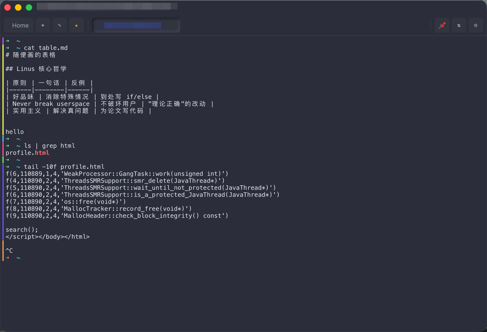
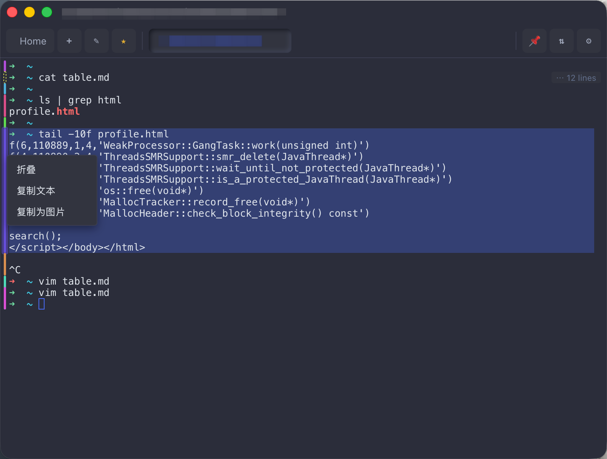
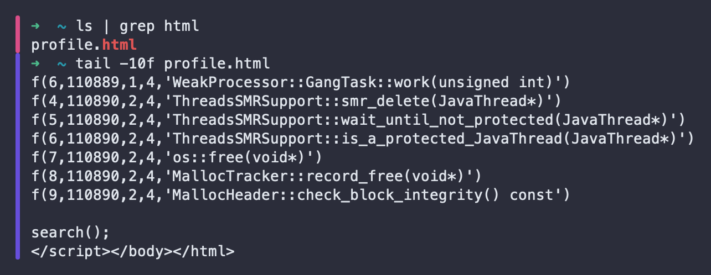

# RSSH 拒绝恶心，哪怕这个问题已经被默认接受了

## 痛点

终端里跑了 10 条命令，输出滚了三屏。你想回头看第 5 条命令的输出从哪儿开始 —— 滚轮往上滚 ……

- 你看到一堆 stack trace，**这是哪条命令的输出？**
- 你看到 `$ ` 提示符，**这是新一条命令还是 ls 输出里有个文件名带 $?**
- 你想把"从第 5 条开始到第 7 条结束"这段贴到 issue 里，**起点和终点完全靠肉眼找**

这是一个很老的问题，老到大家都默认接受了。

## Warp 解决得漂亮 —— 但要侵入服务器

Warp 这一类终端把上面的痛点解决得很好：每条命令一个 block，可以折叠、可以选中、可以独立复制。

代价是：**要在服务器上改 shell**。

```bash
# Warp 的方案需要类似这样的 shell 集成
source /usr/local/share/warp/shell-integration.sh
# 或写进 ~/.bashrc / /etc/profile.d/
```

这在很多场景下根本不可能：

- 公司堡垒机里的目标机器 —— 你没 root，没 sudo，没法改 `/etc/profile.d`
- 一次性救火的临时机器 —— 你不想为了一个调试功能污染人家的 dotfile
- 临时 `ssh` 进 Docker / k8s pod —— 容器里没你的 shell 集成脚本
- 同事的机器、客户的机器、供应商的机器 ……

只要"功能依赖远端配置"，遇到上面任一场景就立刻退化为零。

## rssh 的解法：完全前端

rssh **不在服务器上做任何事**。命令块识别、染色、折叠、复制 —— 全在 xterm.js 数据流上完成。

第一次 ssh 上去就立刻有色条，包括别人的堡垒机、别人的 k8s pod、别人的 Docker exec。



## 工作原理（前端 ~120 行）

核心在 `src/lib/terminal/command-blocks.ts`，规则故意做得极简，没有"智能"过滤：

```ts
// Rule 1: Enter in normal buffer → close previous block, open new one
term.onData(data => {
  if (term.buffer.active.type === "alternate") return;
  for (const ch of data) {
    if (ch === "\r") {
      closeCurrent();
      openNew();
    }
  }
});

// Rule 2: 切到 alternate buffer (vim/top/less/tmux) → 关闭当前，啥也不画
term.buffer.onBufferChange(buf => {
  if (buf.type === "alternate") closeCurrent();
});
```

每个块靠 xterm.js 的 **`IMarker`** 追踪起止行：

- Marker 的行号会跟着 scrollback 自动迁移 —— 终端往上滚多少行，marker 行号自动 -N
- Marker 被修剪出 scrollback 时自动 `dispose` —— 块从 tracker 里消失，对应色条也消失
- 用户拉伸窗口、resize 终端 —— marker 无感知

也就是：rssh 不维护行号、不监听 resize、不算坐标。**xterm.js 已经做了**，rssh 只把它的能力暴露成"块"这个抽象。

## 配色：黄金角 HSL，无限调色板，相邻无冲突

```ts
function colorForIndex(i: number): string {
  const hue = (i * 137.508) % 360;
  return `hsl(${hue.toFixed(1)}, 65%, 58%)`;
}
```

137.508° 是黄金角（360 ÷ φ²）。它保证：

- 任意相邻两个色相差最大化（≈ 137°）
- 永远不会出现"两条相邻命令颜色靠得很近、肉眼分不清"
- 不需要预定义调色板，跑 1 万条命令也不会撞色

固定饱和度 65% + 明度 58% —— 暗色主题 / 亮色主题都还能看清，不刺眼。

## 派生能力：右键菜单

色条不只是装饰。**右键点击任意色条，弹一个菜单**：

- **折叠 / 展开** —— 把这条命令的输出收起来，只露 prompt 那一行；再点一次展开
- **复制为纯文本** —— 不带 ANSI、不带宽字符乱码、软换行自动拼回（粘到 issue 里直接可执行）
- **复制为图片** —— 把这条命令的输入+输出渲染成 PNG，贴到 Slack / 邮件 / 微信，颜色保留



### 折叠的实现 —— xterm 私有 API + buffer splice

折叠不是"用 CSS 隐藏行"那种鸡贼做法（隐藏的行还在滚动条里占位、复制时还会拷出来），而是**真的把 buffer 里这段行抽出来**：

```
fold 流程：
  buffer.lines.splice(start, count) 把这段行抽出 → 
  push 同样数量空行补足 buffer 长度（xterm 隐藏不变量：lines.length === ybase + rows）→ 
  调整 ybase / ydisp / cursor.y 让渲染对齐

unfold 流程：
  splice 把保存的行塞回原位 → 
  尽力 pop buffer 末尾我们 push 进去的空行（不一定能全部 pop，cursor 有上下边界）→ 
  cursor 位置和 ybase 同步调整
```

复杂吗？非常复杂！！！ 但代价是值得的：**折叠后的终端**和你**没折过的终端**在 xterm.js 眼里完全一样 —— 滚动、选中、复制、查找全部工作正常。

这事在 `src/lib/terminal/folds.ts` 里，依赖 `_core.buffer` 的几个私有 API（`lines.splice` / `addMarker` / `getBlankLine`）。`package.json` 锁了 `@xterm/xterm@5.5.0`，升级 xterm 之前必须重跑 `folds.test.ts` 全套验证。

### 复制为图片

把块内每行的 xterm cell 数据（字符 + 前景色 + 背景色 + bold/italic 属性）取出来，按当前终端字体在 canvas 上重画一遍。CJK 宽字符按 width=2 处理，软换行按逻辑行合并。

输出的 PNG 直接可贴 —— 贴 Slack 不会被压缩成模糊缩略图（不是截屏），贴 issue 不需要附件路径，贴微信不会丢颜色。



## 一键开关

设置 → 外观 → "命令块色条"，一键关。

```
[x] 显示命令块左侧色条
[x] 命令块右键菜单（折叠 / 复制）
```

不喜欢就关，零代价。

---

**一句话**：它不知道你在哪台机器上，也不需要知道。所有逻辑跑在你本机的 xterm.js 数据流上 —— 远端只是一个 byte 源。
